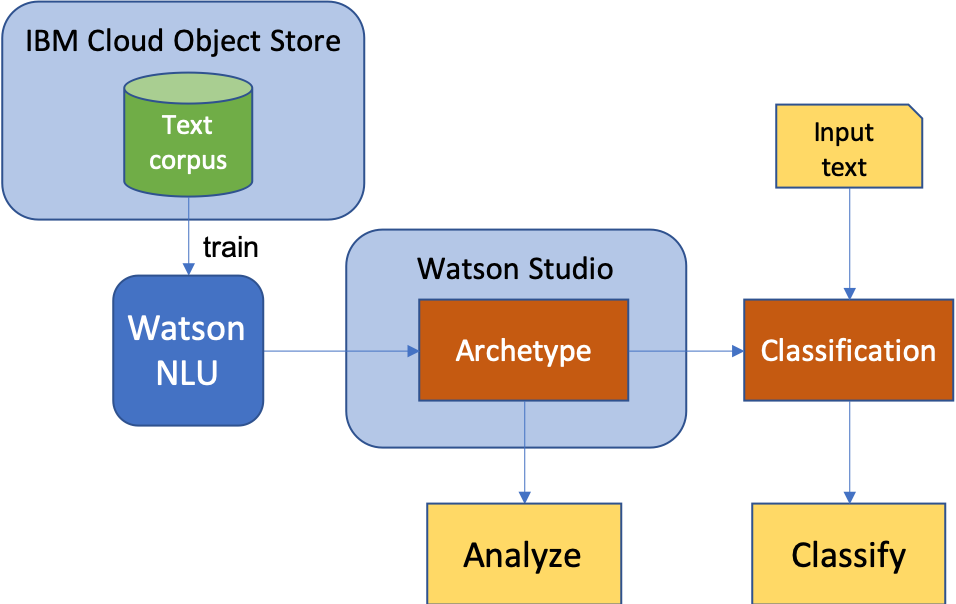

# Discover the archetypes in your system of records

Systems of records are ubiquitous in the world around us, ranging from music playlists, job listings, medical records, customer service calls, Github issues, etc.  Archetypes are formally defined as a pattern, or a model, of which all things of the same type are copied.  More informally, we can think of archetypes as categories, classes, topics, etc.

When we read through a set of these records, our mind naturally groups the records into some collection of archetypes.
For example, we may sort a song collection into easy listening, classical, rock, etc.  This manual process is practical
for a small number of records (e.g., a few dozen).  Large systems can have millions of records, so we need an
automated way to process them.  In addition, without prior knowledge of these records, we may not know beforehand the
archetypes that exist in the records, so we also need a way to discover meaningful archetypes that can be adopted.
Since records are often in the form of unstructured text, such automated processing needs to be able to understand
natural language.  Watson Natural Language Understanding, coupled with statistical techniques, can help you to:

1) discover meaningful archetypes in your records and then
2) classify new records against this set of archetypes.

In this example, we will use a medical dictation data set to illustrate the process. The data is provided by [ezDI](https://www.ezdi.com) and includes 249 actual medical dictations that have been anonymized.

When the reader has completed this code pattern, they will understand how to:

* Work with the `Watson Natural Language Understanding` service (NLU) through API calls.
* Work with the `IBM Cloud Object Store` service (COS) through the SDK to hold data and result.
* Perform statistical analysis on the result from `Watson Natural Language Understanding`.
* Explore the archetypes through graphical interpretation of the data in a Jupyter Notebook or a web interface.



## Flow
1. The user downloads the custom medical dictation data set from [ezDI](https://www.ezdi.com) and prepares the text data for processing.
1. The user interacts with the Watson Natural Language Understanding service via the provided application UI or the Jupyter Notebook.
1. The user runs a series of statistical analysis on the result from Watson Natural Language Understanding.
1. The user uses the graphical display to explore the archetypes that the analysis discovers.
1. The user classifies a new dictation by providing it as input and sees which archetype it is mapped to.


## Included components

* [IBM Watson Natural Language Understanding](https://cloud.ibm.com/docs/services/natural-language-understanding?topic=natural-language-understanding-getting-started): process a clip of natural text and return a number of attributes such as sentiment, keywords, entities, relationship, concepts, categories.  


## Featured technologies

* [IBM Watson Natural Language Understanding](https://cloud.ibm.com/docs/services/natural-language-understanding?topic=natural-language-understanding-getting-started):  advanced models that process text in natural language and produce relevant information that can be used directly or in further processing downstream.
* [IBM Watson Studio](https://dataplatform.cloud.ibm.com/docs/content/wsj/getting-started/overview-ws.html?audience=wdp&context=wdp): a comprehensive environment and tools to work with your data.
* [IBM Cloud Object Store](https://www.ibm.com/cloud/object-storage): easily store and manage your data without limit.
* [AI in medical services](https://www.ezdi.com): save time for medical care providers by automating tasks such as entering data into Electronic Medical Record.


# Watch the Video

Coming soon.

# Steps

1. [Clone the repo](#1-clone-the-repo)
1. [Create IBM Cloud services](#2-create-ibm-cloud-services)
1. [Download and prepare the data](#3-download-and-prepare-the-data)
1. [Run the Jupyter notebook](#4-run-the-jupyter-notebook)
1. [Run the Web UI](#5-run-the-web-ui)

## 1. Clone the repo
```bash
git clone https://github.com/IBM/discover-archetype
```

## 2. Create IBM Cloud services
You will use 3 IBM Cloud services.   

### a. Watson Natural Language Understanding
On your [IBM Cloud dashboard](https://cloud.ibm.com/), using the left-side navigation menu,
navigate to Watson -> Watson Services -> Browse Services -> [Natural Language Understanding](https://cloud.ibm.com/catalog/services/natural-language-understanding).
Select the Lite plan and click `Create`.
When the service becomes available, copy the endpoint and credentials for use later.

### b. IBM Cloud Object Store
On your [IBM Cloud dashboard](https://cloud.ibm.com/), using the left-side navigation menu, navigate to Classic Infrastructure -> Storage -> [Object Storage](https://cloud.ibm.com/catalog/services/cloud-object-storage).
Select the Lite plan and click `Create`.
When the service becomes available, click on `Create bucket` and create two buckets:  one for the medical dictation and one for the NLU result.
Copy the bucket instance CRN, endpoints and credentials for use later.

### c. Watson Studio
On your [IBM Cloud dashboard](https://cloud.ibm.com/), using the left-side navigation menu, navigate to Watson -> Watson Services -> Browse Services -> [Watson Studio](https://cloud.ibm.com/catalog/services/data-science-experience).
Select the Lite plan and click `Create`.
Click on `New project` and create an empty project.  Navigate into your new empty project and click on `New notebook`.  Select `From file` and upload the Jupyter notebook from the local git repo:

```
discover-archetype/notebook/WATSON_Document_Archetypes_Analysis_Showcase.ipynb
```


## 3. Download and prepare the data

Go to the [ezDI](https://www.ezdi.com/open-datasets/) web site and download both the medical dictation text files.
The downloaded files will be contained in zip files.

Create a `notebook/Documents` subdirectory and then extract the downloaded zip files into their respective locations.

The dictation files stored in the `notebook/Documents` directory will be in **rtf** format, and need to be converted to plain
text. Use the following bash script to convert them all to **txt** files.

> Note: Run the following script with Python 3.

```bash
pip install striprtf
cd notebook/Documents
python ../python/convert_rtf.py 
```

Upload the dictation files in text format to the IBM Cloud Object Store bucket for dictation.


## 4. Run the Jupyter notebook
### a. Configure credentials and endpoints
In the Jupyter console, the second cell contains a number of parameters that need to be filled out with the necessary
credentials, endpoints, and resource IDs for the 3 IBM Cloud services.  Use the values obtained from [step 2](#2-create-ibm-cloud-services).
Then use the console to execute each cell in the notebook.  

## 5. Run the Web UI
Follow the instructions in the [README](https://github.com/IBM/discover-archetype/blob/master/web-app/README.md)
